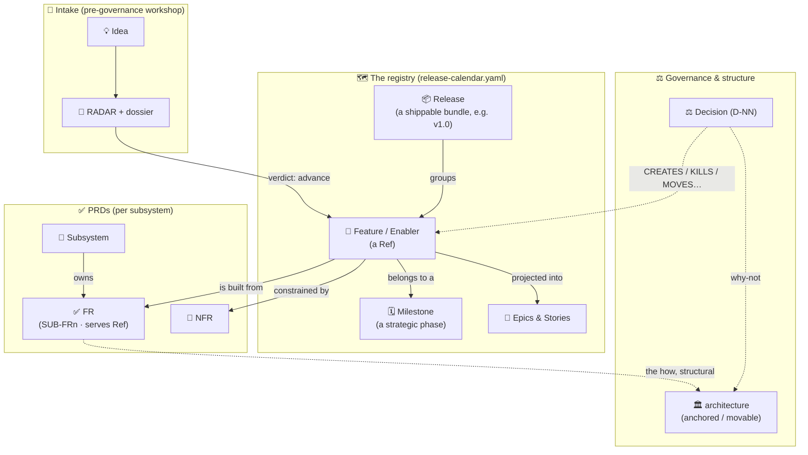
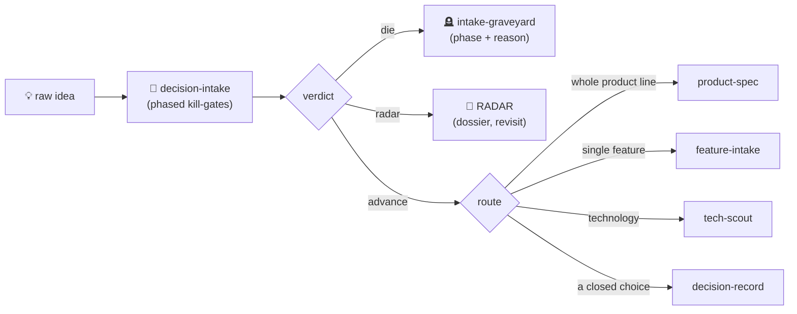

<div align="center">

# 🧭 BMAD Governance Kit

**A plan tells you what to build. Governance keeps it true while you build it.**

*A Claude Code plugin that turns a BMAD-planned project into a governed one — and keeps it from drifting.*


</div>

---

## Contents

- [Why this exists](#why-this-exists)
- [The entities — and how they relate](#the-entities--and-how-they-relate)
- [The four pillars — where each fact lives](#the-four-pillars--where-each-fact-lives)
- [The calendar file, annotated](#the-calendar-file-annotated)
- [How work flows — the processes in detail](#how-work-flows--the-processes-in-detail)
  - [1 · Scaffold the layer](#1--scaffold-the-layer)
  - [2 · Intake — from raw idea to a verdict](#2--intake--from-raw-idea-to-a-verdict)
  - [3 · Feature-intake — register a shaped feature](#3--feature-intake--register-a-shaped-feature)
  - [4 · Decision-record — close the why-not](#4--decision-record--close-the-why-not)
  - [5 · Tech-scout — adopt a technology](#5--tech-scout--adopt-a-technology)
  - [6 · Governance-check — prove coherence](#6--governance-check--prove-coherence)
  - [7 · Epics-projection — project the build](#7--epics-projection--project-the-build)
  - [8 · Test-strategy & fix](#8--test-strategy--fix)
- [Quick start](#quick-start)
- [The commands at a glance](#the-commands-at-a-glance)
- [What's in the box](#whats-in-the-box)
- [Relationship to BMAD](#relationship-to-bmad)

---

## Why this exists

BMAD is excellent at *planning* — brief → PRD → architecture → epics. But a plan is a snapshot, and the moment many people and many sessions start editing it, it **drifts**:

- a feature ships that nobody can trace to a requirement — or a requirement everyone forgot to build;
- the same decision gets re-litigated months later because no one wrote down *why* it was closed;
- the "source of truth" for what maps to what lives in five files, and they quietly disagree;
- the architecture grows a second database because its backbone was never written down.

None of this is a *planning* failure — it's a **governance** failure. The plan had no structure to stay honest. This kit installs that structure and the commands that keep it honest, **without forking BMAD**: it governs, and delegates the thinking back to BMAD.

> **The promise in one line:** every feature is traceable to its requirements, every decision keeps its *why*, and a single command proves the whole graph still agrees.

---

## The entities — and how they relate

The model has a small, closed set of entities. This is the map of all of them and how they connect — read it once and the rest of the kit reads itself.



### The registry entities

- 📦 **Release** — a **shippable bundle/version** and the *top-level* grouping in the calendar (e.g. `v1.0`). It has its own rollout **status** and gathers the features that go out together. It answers *"what ships, together, when?"*. A feature that isn't in any active release is `unscheduled`.
- 🗓️ **Milestone** — the **strategic phase** a feature belongs to (e.g. `v1`, `v2`, or a named hypothesis phase). It's a *closed vocabulary* declared once, in the calendar's `config.milestones`. Release ≠ milestone: a single release can draw features planned under different milestones, and a milestone's features can spread across several releases. Milestone = *which arc of the product*; release = *which shipment*.
- 🎯 **Feature** — a **business capability**, vertical (something a user can point at). Its handle — a kebab-case **`Ref`** like `portal-booking` — is the calendar entry key **and the join key** that stitches it across every pillar. `grep` a `Ref` and you find every layer it touches.
- 🧱 **Enabler** — **technical work with no user-facing story** (a migration, a shared library). Same shape and same rules as a feature; it just isn't customer-visible.
- 📐 **Epic / Story** — the **build breakdown** of a feature. These are *projected* from a milestone (never authored by hand) and written back onto each feature's calendar entry; the story tracker (`sprint-status.yaml`, BMAD's) owns their live state — the calendar only references them.

### The requirement entities

- 🧩 **Subsystem** — a **layer that owns exactly one question** (e.g. `PAYMENTS`, `UI`, `SEARCH`). Each has an **FR namespace prefix** and its own PRD. Subsystems are the *columns* a feature can touch.
- ✅ **FR (functional requirement)** — **one testable requirement**, living in a subsystem's PRD, named `<SUB>-FRn`, and declaring the `Ref` it `serves`. The rule is **one FR per subsystem, per feature**: a feature touching three subsystems has exactly three FRs, all serving the same `Ref`. The `serves <Ref>` tag is the FR-side of the join.
- 📏 **NFR (non-functional requirement)** — a **cross-cutting constraint** (latency, security, data residency, cost…). It lives in a PRD's NFR section, is named `NFR-<CODE>`, and is *referenced* by features (in the calendar's `nfrs[]`) and tests — never registered as a feature, never an FR.

### The decision entities

- ⚖️ **Decision (`D-NN`)** — a **closed choice**, recorded in an **append-only** log. Every decision carries an **effect verb** that says what it does to the graph — `CREATES` · `CONSTRAINS` · `KILLS` · `MOVES` · `PROMOTES` · `REWORKS` · `REFRAMES` · `governance.` — which drives where its consequence propagates.
- 🔒 **Decision lifecycle** — the log is never rewritten. A decision is **`IN-FORCE`**; a later one either **supersedes** it (the old entry flips to `SUPERSEDED` and gains a forward pointer, its text untouched) or **reframes / narrows / refines** it (the old entry *stays* `IN-FORCE`, only its scope changes). The *why* is therefore never lost or re-litigated.
- ⚓ **`anchored` / `movable`** — the tag on every **structural** decision in `architecture`. *anchored* = backbone, costly to move (moving it is a conscious retrofit); *movable* = reschedulable freely. This tag is also what `epics-projection` uses to order the build (anchored first).

### The lifecycle & status entities

- 🚦 **Status** — where a calendar entry is in its life, from a closed set: `backlog` · `in-progress` · `done` · `unscheduled` · `blocked` · `killed`.
- 🪦 **Graveyard** — **not a file you maintain**: it is a *derived view* of every entry at `status: killed` plus the `D-NN` that closed it. Killed things are never deleted or reopened.
- 📡 **RADAR / dossier / intake-graveyard** — the **pre-governance workshop** (`intake/`). The RADAR is the live list of raw ideas being diagnosed; each idea has a lightweight **dossier**; ideas (or variants, or considered vendors) that die during diagnosis go to the granular **intake-graveyard**. Nothing here is governance until a verdict routes it in.

---

## The four pillars — where each fact lives

Every durable fact lives in **exactly one** pillar. Cross-pillar, the `Ref` (feature) and the `D-NN` (decision) are the only join keys.

| Pillar | Owns | The rule |
|---|---|---|
| 🗺️ **ROADMAP** — `ROADMAP.md` + `release-calendar.yaml` | **WHAT + ORDER + the join** | a narrative `ROADMAP.md` (milestones and the *why*, in prose) + `release-calendar.yaml` (the single structured join: release → feature → milestone → FRs/NFRs → epics → stories) |
| ✅ **PRD(s)** | **HOW — testable** | FRs namespaced per subsystem (`<SUB>-FRn`), each declaring the `Ref` it `serves`; NFRs in their own section |
| ⚖️ **DECISIONS** | **WHY-NOT** | an append-only log of `D-NN`, with forward supersede/reframe pointers |
| 🏛️ **architecture** | **HOW — structural** | the invariant spine, per-subsystem structure, milestone deltas; every decision tagged `[milestone · anchored\|movable · serves <Ref>]` |

**The one rule that prevents drift:** if changing a fact means editing the same sentence in two pillars, you're duplicating — stop. Propagating a *consequence* (a status in the calendar, a new FR in a PRD, a spine decision in architecture) joined by a shared `Ref`/`D-NN` is fine; copying the same *text* is the drift. Full model in [`reference/governance-model.md`](reference/governance-model.md).

### Why the join is a YAML, not a table

The join — *which requirements a feature is built from* — drifts fastest, because it's traditionally a Markdown "coverage matrix" copied across the ROADMAP and every PRD, edited by hand, owned by no one. This kit puts it in **one file, `release-calendar.yaml`**, and makes it **mechanically honest**:

- ✍️ **written only through `calendar-ops.py`** — a structured operation, never hand-edited or string-matched;
- 🔎 **validated by schema** with `validate-release-calendar.py` — every FR in the calendar exists in its PRD, every `(feature, FR)` pair is confirmed by the PRD's `serves`, and no requirement is orphaned;
- 📖 the narrative `ROADMAP.md` carries the story for humans; the yaml carries the join for machines. **One source, one validation.**

---

## The calendar file, annotated

Here is the whole model in one artifact — a real `release-calendar.yaml`, annotated:

```yaml
config:                          # ── declared once; makes the tooling project-agnostic
  prd_dir: prds                  #    where the PRDs live
  subsystems:                    #    each subsystem's FR-namespace → its PRD file
    PAYMENTS: prd-payments.md
    UI:       prd-ui.md
  milestones: [v1, v2]           #    the closed milestone vocabulary

releases:
  v1.0:                          # ── a RELEASE: a shippable bundle, with its own status
    status: in-progress
    features:
      portal-booking:            # ── a FEATURE (its Ref = the join key)
        milestone: v1            #    the strategic phase it belongs to
        frs: [PAYMENTS-FR7, UI-FR3]   # the FRs it's built from — one per subsystem
        nfrs: [NFR-LATENCY]      #    the cross-cutting constraints it must honour
        epics: [epic-v1-2]       #    ← written back by epics-projection
        stories: [V1-2.1, V1-2.4]#    ← written back by epics-projection
    enablers:
      payments-schema:           # ── an ENABLER: technical, no user-facing story
        milestone: v1
        frs: [PAYMENTS-FR1]
        nfrs: []
        epics: [epic-v1-1]
        stories: [V1-1.1]

  v2.0:
    status: backlog
    features:
      saved-cards:
        milestone: v2
        frs: []                  #    empty frs[] = an orphan (flagged by governance-check)
        status: killed           #    a per-entry status override…
        decisions: [D-42]        #    …with the D-NN that closed it (the Graveyard is derived)
```

And the matching FR in `prds/prd-payments.md` — its `serves` tag is what the validator cross-checks:

```markdown
#### PAYMENTS-FR7 — hold funds on booking
`[v1 · movable · serves portal-booking]` · realizes UJ-4 · D-31

The system authorizes (but does not capture) the amount when a booking is placed.

**Consequences (testable):**
- an authorization is created within 2s of a confirmed booking *(impl: architecture.md §Payments)*.
```

---

## How work flows — the processes in detail

Every recurring action is a **command**; nothing is improvised. Here is the full loop, then each step.

```
   decision-intake ──▶ (product-spec) ──▶ feature-intake ──▶ governance-check ──▶ epics-projection ──▶ build
        │                                       ▲                                                        │
        └── verdict routes to ──▶ tech-scout ───┘                              fix ◀── bug / non-feature ┘
                                     │
                              decision-record  (the scribe every path calls to close a D-NN)
```

### 1 · Scaffold the layer

`governance-scaffold` (multi-step) reads your existing BMAD planning artifacts (brief, PRDs, architecture, epics) and **projects them into the four pillars** + a `GOVERNANCE.md` constitution + the supporting stores. It **adds no product scope** — it organizes what planning already produced and *surfaces its blind spots*: orphan features, un-phased work, decisions that were made but never written down. It copies the calendar tooling (`calendar-ops.py`, `validate-release-calendar.py`) next to the yaml. Idempotent — greenfield or merge onto a partially-governed project.

### 2 · Intake — from raw idea to a verdict

`decision-intake` is the **workshop *before* the registry** — the office-hours funnel that gives a raw idea *shape* before any governance is written. It runs as a **conversation, not a form**: open questions, one at a time, in plain language, safe for non-technical stakeholders.

Two gates open every session: a **scope gate** (only product/business ideas pass; internal tooling is routed away) and a **re-litigation gate** (`grep` the graveyard + RADAR first — a dead idea doesn't reopen without new facts; a live one resumes its dossier).

It then runs a **phased diagnosis, where each phase is a kill-gate**:

1. **Business** — is this *us*? demand, status-quo, a *named* human, the narrowest wedge. A red-team pass is **mandatory before any kill**.
2. **Product** — a one-line job-to-be-done, fit with existing lines, and an explicit **committed-vs-hypothesis** split. **≥2 alternatives** from different angles are generated and stressed; rejected ones become granular graveyard rows so they're never re-argued.
3. **Architecture-fit** (read-only) — fits-spine / fits-with-delta / needs-new-spine, a preliminary anchored-vs-movable, the small-team maintainability filter. (If the idea is really a *technology* question, this phase **is** `tech-scout`.)
4. **Business-model** — economic / contractual / offer lenses, with **real numbers and a cited source**. An unknown number is named as an open question, never faked.

The skill then **proposes** one of three verdicts — **die · radar · advance** — and *the human closes it*. It never writes governance by hand; on **advance** it decomposes and routes:



### 3 · Feature-intake — register a shaped feature

`feature-intake` takes a feature that *already has shape* and lands it correctly. It enters the **Backlog** first (pre-triage), then runs a triage gate — which subsystem(s)? does it fit the spine (**anchored/movable**)? does it clash with a live `D-NN`? does a small team pass the maintainability filter? Two outcomes only:

- **KILL** → open/cite a `D-NN` via `decision-record`, `set-status <ref> killed` (the Graveyard is derived).
- **PROMOTE** → `calendar-ops.py add` the feature (or enabler) with its milestone, then **author one FR per subsystem it touches** (`bmad-prd` writes the prose; the skill enforces the `serves <Ref>` tag, namespace, and one-FR-per-layer rule), then `add-frs` to wire the join and **`validate-release-calendar.py` to PASS**.

Crucially, `feature-intake` **cannot touch the spine** — if a feature needs a new backbone element, it stops and routes to `decision-record`.

### 4 · Decision-record — close the why-not

`decision-record` is the **only** writer of the decision log, and a **scribe, not a decider**: it writes only when it can name what closed the decision (an explicit human close, an intake "advance" verdict, or a dated session) — otherwise it stops and routes back to intake. It appends one `D-NN` (append-only, never editing a closed entry), dumps long rationale to `history/`, and **propagates the consequence** across the other pillars driven by the effect verb — every calendar mutation via `calendar-ops.py`, never duplicating the same sentence into two pillars.

### 5 · Tech-scout — adopt a technology

`tech-scout` evaluates a technology/library/vendor against the **spine** (boring-tech bias, small-team maintainable, honours residency/cost/licence constraints), delegating the research to `bmad-technical-research` and the verdict to the architect. Three outcomes: **ADOPT** (record via `decision-record`, propagate the footprint), **REJECT** (killed via a decision), or **SPIKE-FIRST** (an empirical unknown — set the calendar entry `blocked` + open a phase-blocker in architecture; adopt nothing until it's answered).

### 6 · Governance-check — prove coherence

`governance-check` is a **read-only** auditor — it never fixes anything, it hands you the fix and the command that owns it. It runs `validate-release-calendar.py` (the join must PASS), plus the invariants no validator knows: no orphan features, no duplicated facts across pillars, correct FR namespacing, an append-only/coherent decision log, present anchored/movable tags, a coherent derived Graveyard, and intake coherence (RADAR ⇄ dossiers). It wraps BMAD's `bmad-check-implementation-readiness` + adversarial reviewers into **one** PASS/WARN/FAIL report.

```
$ python3 validate-release-calendar.py
features=42 · (feature,FR) pairs=118 · FRs in PRDs=118

PASS — 0 errors, 0 warnings
```

That green line is the whole point: **the plan and the requirements provably agree.** When they don't, it tells you exactly where.

### 7 · Epics-projection — project the build

`epics-projection` turns a milestone into an ordered, build-ready `epics.md` — a **regenerable projection, never a source of truth**. It reads the milestone's features + their `frs[]` from the calendar, delegates the story expansion to `bmad-create-epics-and-stories`, orders them **anchored-first** using the architecture tags, and **writes `epics[]`/`stories[]` back to each calendar entry**. Change the roadmap, re-project — never hand-patch.

### 8 · Test-strategy & fix

`test-strategy` designs *how* a milestone is tested (the layer above the per-story pipelines) and writes the gates into the test-standards doc. `fix` is the short path for a **bug or non-feature change** — no new `Ref`/FR — and if a "fix" turns out to be new capability or a wrong spec, it stops and routes back through governance.

---

## Quick start

```
/plugin marketplace add osscarvalls/bmad-governance-kit
/plugin install bmad-governance-kit@bmad-governance-kit
```

Then, in a project you've already planned with BMAD:

```
/bmad-governance-kit:governance-scaffold
```

From then on, every recurring action is a command (`/bmad-governance-kit:<command>`).

> **Requirements:** the calendar tooling needs **Python 3 + PyYAML** (`pip install pyyaml`). BMAD is the recommended companion but not a hard dependency — see [Relationship to BMAD](#relationship-to-bmad).

---

## The commands at a glance

| Command | What it does |
|---|---|
| `governance-scaffold` | Lay the four pillars + constitution + tooling from an existing BMAD plan (idempotent) |
| `decision-intake` | Diagnose a raw idea/opportunity/vendor by phased kill-gates → a verdict that routes onward |
| `product-spec` | Specify a whole product line: brief → journeys → deep PRDs → UX → architecture |
| `feature-intake` | Register a shaped feature: Backlog → triage → kill **or** land it in the calendar + one FR per layer |
| `decision-record` | Append a closed decision (`D-NN`), add supersede pointers, propagate — never duplicating |
| `tech-scout` | Evaluate a technology against the spine → adopt + record, or open a spike |
| `governance-check` | Read-only coherence audit → one PASS/WARN/FAIL report; never auto-fixes |
| `epics-projection` | Project a milestone's epics (regenerable) → write stories back to the calendar → hand off to build |
| `test-strategy` | Design a milestone's test strategy + gates → write the test standards |
| `fix` | The short path for a bug / non-feature change (no new `Ref`/FR) |

---

## What's in the box

```
bmad-governance-kit/
├── .claude-plugin/           # plugin.json + marketplace.json (the repo is its own marketplace)
├── reference/                # read these to understand the model
│   ├── governance-model.md         # the whole model, in one read
│   ├── controlled-vocabularies.md  # status vocab · tag grammar · effect verbs · calendar shape
│   └── operating-contract.md       # the contract every skill obeys
└── skills/
    ├── governance-scaffold/  # the scaffolder (7 steps) + assets/
    │   └── assets/
    │       ├── templates/    # ROADMAP · GOVERNANCE · PRD · architecture · release-calendar.yaml · todos
    │       └── scripts/      # calendar-ops.py (the only writer) · validate-release-calendar.py
    ├── decision-intake/  product-spec/  feature-intake/  decision-record/
    ├── tech-scout/  governance-check/  epics-projection/  test-strategy/  fix/
```

---

## Relationship to BMAD

This kit contributes **topology + sequence + discipline** — which pillar a fact belongs to, the format, the anti-drift rules. It does **not** re-implement analysis or design: wherever a judgement call is needed it **delegates to a BMAD command if one is available** (`bmad-agent-architect` for anchored/movable, `bmad-prd` for FR wording, `bmad-check-implementation-readiness` for the coherence gate, `bmad-create-epics-and-stories` for expansion, the `bmad-testarch-*` suite for testing…) and **degrades gracefully** — doing the call itself, and saying so — when BMAD is not installed.

So the kit is **usable standalone**, but reaches full quality on a project that also has BMAD installed. BMAD is the recommended companion, not a hard dependency.

---

<div align="center">

**MIT** · Built for [Claude Code](https://claude.com/claude-code) · Pairs with [BMAD](https://github.com/bmad-code-org/BMAD-METHOD)

</div>
