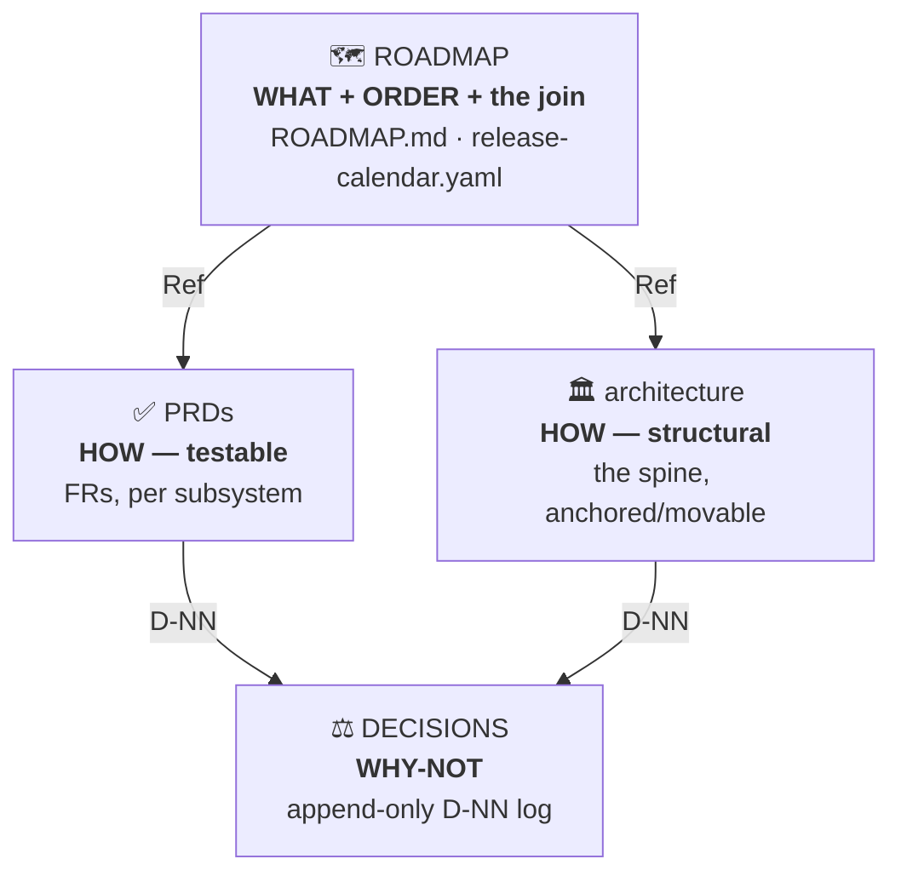
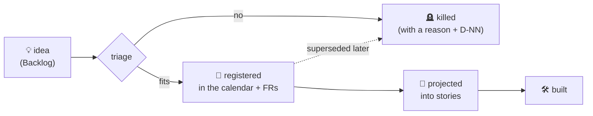

<div align="center">

# 🧭 BMAD Governance Kit

**A plan tells you what to build. Governance keeps it true while you build it.**

*A Claude Code plugin that turns a BMAD-planned project into a governed one — and keeps it from drifting.*


</div>

---

## Why this exists

BMAD is excellent at *planning* — brief → PRD → architecture → epics. But a plan is a snapshot, and the moment many people and many sessions start editing it, it **drifts**:

- a feature ships that nobody can trace to a requirement — or a requirement everyone forgot to build;
- the same decision gets re-litigated months later because no one wrote down *why* it was closed;
- the "source of truth" for what maps to what lives in five files, and they quietly disagree;
- the architecture grows a second database because its backbone was never written down.

None of this is a *planning* failure — it's a **governance** failure. The plan had no structure to stay honest. This kit installs that structure and the commands that keep it honest, **without forking BMAD**: it governs, and delegates the thinking back to BMAD.

> **The promise in one line:** every feature is traceable to its requirements, every decision keeps its *why*, and a single command proves the whole graph still agrees.

---

## The vocabulary (the nouns of the model)

Six entities, and how they relate. Learn these and the rest of the model reads itself.

| Entity | What it is | Example |
|---|---|---|
| 🎯 **Feature** (`Ref`) | A business capability, vertical. Its **`Ref`** — a kebab-case handle — is the **join key** that stitches it across every pillar. | `portal-booking` |
| 🧩 **Subsystem** | A layer that owns exactly one question. Each has an FR namespace prefix. | `PAYMENTS`, `UI` |
| ✅ **FR** (functional requirement) | One **testable** requirement, living in a subsystem's PRD, declaring the `Ref` it `serves`. **One FR per subsystem, per feature.** | `PAYMENTS-FR7 · serves portal-booking` |
| 📏 **NFR** | A cross-cutting constraint (latency, security, data residency…). Lives in a PRD's NFR section, never as a feature. | `NFR-LATENCY` |
| 🗓️ **Milestone** | An ordered grouping of features toward a goal. Not a folder — a phase of one deepening platform. | `v1`, `v2` |
| ⚖️ **Decision** (`D-NN`) | A **closed** choice, in an append-only log, carrying an effect verb (`CREATES`/`KILLS`/`MOVES`…) and a `why`. | `D-42` |

Two more you'll meet: an **enabler** is technical work with no user-facing story (same shape as a feature); the **`anchored`/`movable`** tag on a structural decision says whether it's backbone (costly to move → a conscious choice) or freely reschedulable.

---

## The model: four pillars, one truth in one place

Every durable fact lives in **exactly one** pillar. The `Ref` stitches them into a navigable graph — `grep` a `Ref` and you reach every layer a feature touches.



| Pillar | Owns | In one line |
|---|---|---|
| 🗺️ **ROADMAP** | **WHAT + ORDER + the join** | a narrative `ROADMAP.md` (the milestones and the *why*, in prose) + `release-calendar.yaml` (the single structured join: each feature → its milestone, FRs/NFRs, epics, stories) |
| ✅ **PRD(s)** | **HOW — testable** | functional requirements, namespaced per subsystem (`<SUB>-FRn`), each declaring the `Ref` it `serves`; NFRs in their own section |
| ⚖️ **DECISIONS** | **WHY-NOT** | an append-only log of closed decisions (`D-NN`) with forward supersede/reframe pointers — the *why* is never lost or re-litigated |
| 🏛️ **architecture** | **HOW — structural** | the invariant spine, per-subsystem structure, milestone deltas; every decision tagged `[milestone · anchored\|movable · serves <Ref>]` |

**The one rule that prevents drift:** if changing a fact means editing the same sentence in two pillars, you're duplicating — stop. Full model in [`reference/governance-model.md`](reference/governance-model.md).

### Why a YAML for the join, not a table

The join — *which requirements a feature is built from* — drifts fastest, because it's traditionally a Markdown table copied across the ROADMAP and every PRD, edited by hand, owned by no one. This kit puts it in **one file, `release-calendar.yaml`**, and makes it **mechanically honest**:

- ✍️ **written only through `calendar-ops.py`** — a structured operation, never hand-edited or string-matched;
- 🔎 **validated by schema** with `validate-release-calendar.py` — every FR in the calendar exists in its PRD, every `(feature, FR)` pair is confirmed by the PRD's `serves`, and no requirement is orphaned;
- 📖 the narrative `ROADMAP.md` carries the story for humans; the yaml carries the join for machines. **One source, one validation.**

---

## The lifecycles (the verbs of the model)

Governance isn't static structure — it's a set of **one-way flows** that keep facts honest over time.

**A feature's life** — nothing is ever "loose", and nothing is silently deleted:



**A decision's life** — the log is **append-only**, so the *why* is never rewritten or lost:

- a decision is **`IN-FORCE`**;
- a later one **supersedes** it → the old entry flips to `SUPERSEDED` and gains a forward pointer (its text is never edited);
- or a later one **reframes / narrows / refines** it → the old entry *stays* `IN-FORCE`, only its scope changes.

**A milestone's epics** are **projected, never authored** — `epics-projection` filters a milestone, expands its features into stories (ordered anchored-first from the architecture tags), and writes them back to the calendar. Change the roadmap, re-project. The projection is regenerable; it is never a source of truth.

---

## Quick start

```
/plugin marketplace add osscarvalls/bmad-governance-kit
/plugin install bmad-governance-kit@bmad-governance-kit
```

Then, in a project you've already planned with BMAD:

```
/bmad-governance-kit:governance-scaffold
```

The scaffolder reads your existing planning artifacts and lays down the four pillars + a `GOVERNANCE.md` constitution. From then on, every recurring action is a command (`/bmad-governance-kit:<command>`).

> **Requirements:** the calendar tooling needs **Python 3 + PyYAML** (`pip install pyyaml`). BMAD is the recommended companion but not a hard dependency — see [Relationship to BMAD](#relationship-to-bmad).

---

## What operating it looks like

A new idea shows up. Instead of landing "loose" in someone's head, it travels a governed path:

```
"what if we let clients book from the portal?"

  → decision-intake     diagnoses it (business → product → fit → verdict)
  → feature-intake      registers `portal-booking` in release-calendar.yaml,
                        writes one FR per subsystem it touches, validates the join
  → governance-check    proves the graph is still coherent (schema PASS, no orphans)
  → epics-projection    projects the milestone's stories, writes them back to the calendar
  → build               BMAD story/epic pipelines take it from there
```

And the payoff, any time later:

```
$ python3 validate-release-calendar.py
features=42 · (feature,FR) pairs=118 · FRs in PRDs=118

PASS — 0 errors, 0 warnings
```

That green line is the whole point: **the plan and the requirements provably agree.** When they don't, the same command tells you exactly where.

---

## The commands

**Scaffolder** — lays the substrate from an existing BMAD plan:

- **`governance-scaffold`** *(multi-step)* — reads the BMAD planning artifacts and projects them into the four pillars + the constitution + the twin todo indices + the artifact-taxonomy stores. Idempotent (greenfield or merge). Adds no product scope — it organizes what planning produced and surfaces its blind spots (orphan features, un-phased work, decisions never written down). Ships the pillar templates and the calendar tooling under [`skills/governance-scaffold/assets/`](skills/governance-scaffold/assets/).

**Operators** — keep the layer alive (every recurring action is a command; nothing is improvised):

| Command | What it does |
|---|---|
| `decision-intake` | Diagnose a raw idea / opportunity / vendor by phases with kill-gates → a verdict that routes onward |
| `product-spec` | Specify a whole product line: brief → journeys → deep PRDs → UX → architecture, with a carry-down contract + completeness gate |
| `feature-intake` | Register a shaped feature: Backlog → triage → kill-with-reason **or** land it in the calendar + one FR per layer, join schema-validated |
| `decision-record` | Append a closed decision (`D-NN`), add supersede pointers, propagate the consequence — never duplicating |
| `tech-scout` | Evaluate a technology against the spine → adopt + record, or open a spike |
| `governance-check` | Read-only coherence audit → one PASS/WARN/FAIL report; never auto-fixes |
| `epics-projection` | Project a milestone's epics (regenerable) → write stories back to the calendar → hand off to build |
| `test-strategy` | Design a milestone's test strategy + gates → write the test standards |
| `fix` | The short path for a bug / non-feature change (no new `Ref`/FR) |

Each command reads the target project's `GOVERNANCE.md` to resolve the pillar paths, and the calendar tooling reads its config from the calendar itself — so the kit is **fully portable**: nothing is hardcoded to any one project.

---

## What's in the box

```
bmad-governance-kit/
├── .claude-plugin/           # plugin.json + marketplace.json (the repo is its own marketplace)
├── reference/                # read these to understand the model
│   ├── governance-model.md         # the whole model, in one read
│   ├── controlled-vocabularies.md  # status vocab · tag grammar · effect verbs · calendar shape
│   └── operating-contract.md       # the contract every skill obeys
└── skills/
    ├── governance-scaffold/  # the scaffolder (7 steps) + assets/
    │   └── assets/
    │       ├── templates/    # ROADMAP · GOVERNANCE · PRD · architecture · release-calendar.yaml · todos
    │       └── scripts/      # calendar-ops.py (the only writer) · validate-release-calendar.py
    ├── decision-intake/  product-spec/  feature-intake/  decision-record/
    ├── tech-scout/  governance-check/  epics-projection/  test-strategy/  fix/
```

---

## Relationship to BMAD

This kit contributes **topology + sequence + discipline** — which pillar a fact belongs to, the format, the anti-drift rules. It does **not** re-implement analysis or design: wherever a judgement call is needed it **delegates to a BMAD command if one is available** (`bmad-agent-architect` for anchored/movable, `bmad-prd` for FR wording, `bmad-check-implementation-readiness` for the coherence gate, `bmad-create-epics-and-stories` for expansion, the `bmad-testarch-*` suite for testing…) and **degrades gracefully** — doing the call itself, and saying so — when BMAD is not installed.

So the kit is **usable standalone**, but reaches full quality on a project that also has BMAD installed. BMAD is the recommended companion, not a hard dependency.

---

<div align="center">

**MIT** · Built for [Claude Code](https://claude.com/claude-code) · Pairs with [BMAD](https://github.com/bmad-code-org/BMAD-METHOD)

</div>
